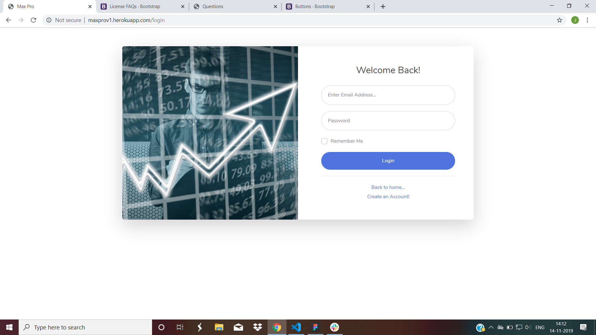
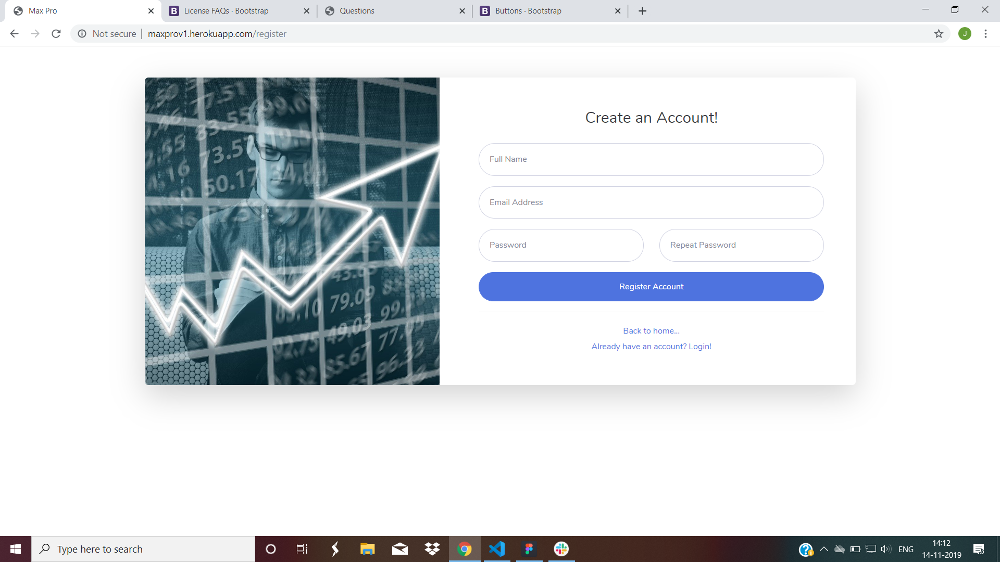
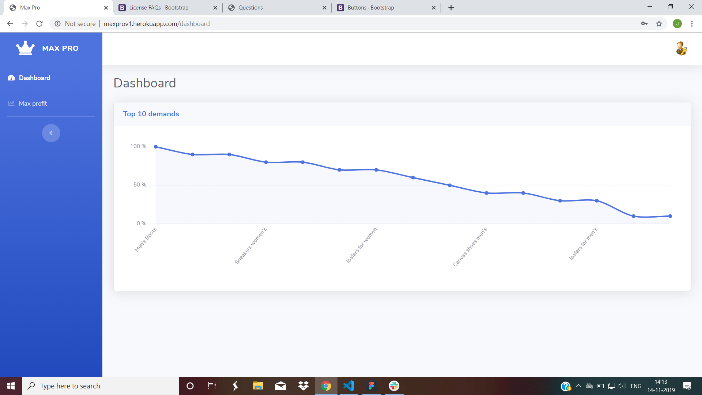
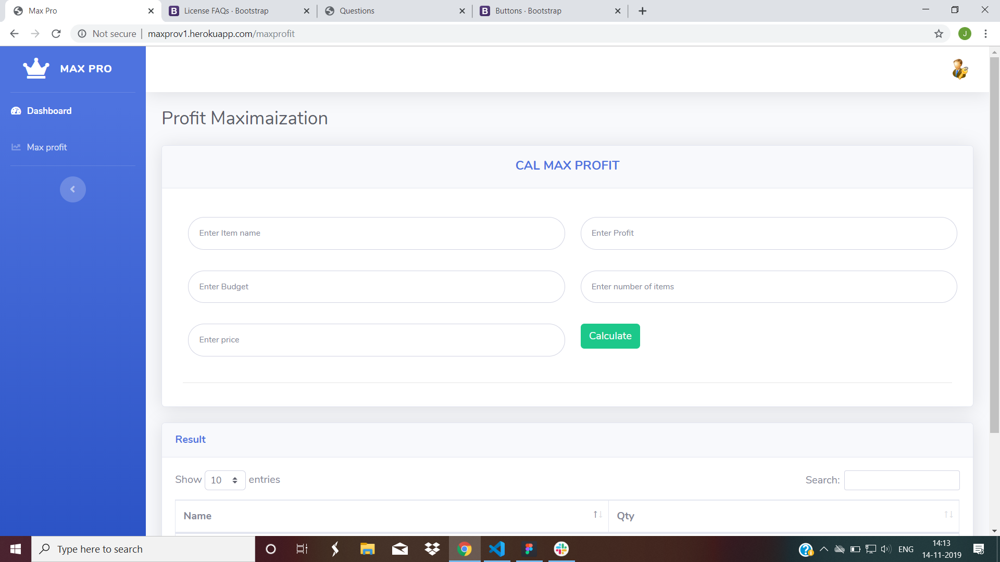

# Max-Pro
This is a MaxPro appication where retailer will get a shopping list to get maximum profit according to his budget.

## Authors
Jashwanthi V 

Shaik Mudassir

## Technology used
HTML, CSS, JavaScript, Node js,Mongoose,Express

## Guidelines
1.Each retailer have to register and login to application.   

2.After logging in you will find the dashboard which contains max profit menu.

3.Click on the max profit menu. 

4.The max profit menu contains itemname,profit,price,demand sections.

5.you have to enter data according to these sections.

6.Enter data one by one separated by comma's.

7.After entering all the data, submit the data.

8.Then,you will get the list of items and quantity which you need to buy.

## Link
http://maxprov1.herokuapp.com/

## Home page

## Login page

## Register page

## Dashboard

## Result

## demo video
[click here](https://youtu.be/eSi3MGR1d8c)
